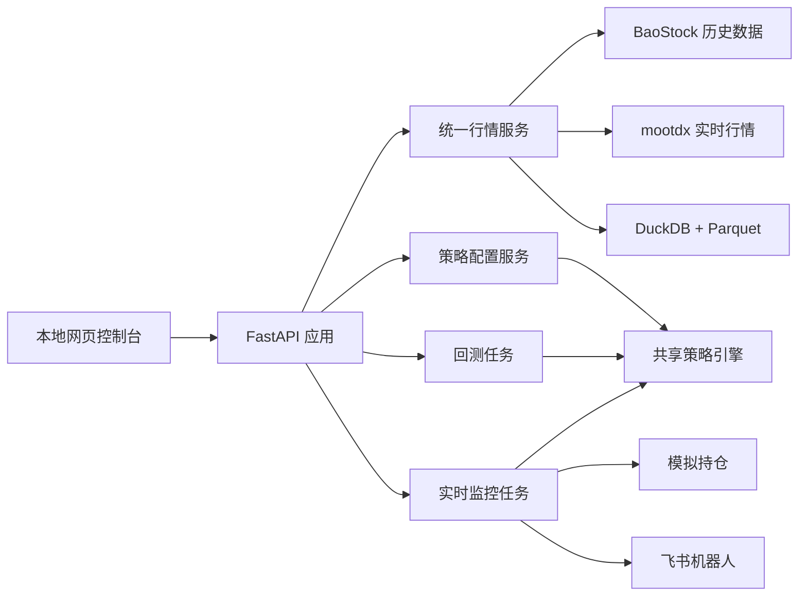

# A 股策略回测与实时监控系统设计

日期：2026-08-20  
状态：已确认

## 1. 目标

构建一个运行在本地 Mac 上的 A 股策略研究系统，同时提供：

- 历史策略回测；
- 实时行情与点位监控；
- 飞书机器人提醒；
- 实时模拟持仓和盈亏跟踪；
- 本地网页控制台。

系统服务单个本地用户，不接券商、不执行真实交易。第一版优先保证回测可复现、实时监控可靠、信号可解释，不追求多用户、云部署或高频交易。

## 2. 已确认的产品决策

| 项目 | 决策 |
| --- | --- |
| 市场 | 仅 A 股 |
| 运行环境 | 当前 Mac 本地运行 |
| 使用界面 | 本地网页控制台 |
| 推送渠道 | 飞书机器人 |
| 回测周期 | 5、15、30、60 分钟，日、周、月 |
| 策略形式 | 配置式策略与 Python 自定义策略 |
| 策略范围 | 单股与多股票组合 |
| 配置式指标 | MA、MACD、KDJ、RSI、布林带、价格、成交量 |
| 条件组合 | 一层 AND/OR 条件组 |
| 回测模式 | 简化模式与真实 A 股模式 |
| 实时范围 | 自选股高频监控与全市场低频扫描 |
| 监控频率 | 自选股每 5 秒，全市场每 5 分钟 |
| 实时动作 | 飞书推送并可维护模拟持仓 |
| 真实交易 | 不支持 |

## 3. 总体架构

采用 Python 模块化单体。网页、数据采集、策略、回测、监控和通知位于同一项目中，但通过明确接口隔离。回测在独立后台进程执行，实时监控在常驻调度任务中执行，避免大规模回测阻塞行情采集。



### 3.1 模块边界

- **Web 应用**：页面、表单、任务状态和结果展示，不包含行情或交易规则。
- **统一行情服务**：数据源适配、字段标准化、单位换算、聚合、缓存和质量检查。
- **策略引擎**：执行配置式条件或 Python 策略，不直接访问外部数据源。
- **回测引擎**：历史事件循环、订单撮合、资金持仓、费用和绩效计算。
- **实时监控**：交易时段调度、行情轮询、信号状态、模拟成交和任务恢复。
- **通知服务**：飞书消息格式、签名、重试和发送记录。
- **存储服务**：K 线文件、系统状态、策略、任务、信号、订单和结果。

## 4. 数据设计

### 4.1 数据来源

- BaoStock 提供历史日线、历史 5 分钟线、交易日历、股票列表、复权因子和公司行为。
- mootdx 提供交易时段实时价格、成交量、成交额、五档盘口和当前分钟行情。
- 盘后使用 BaoStock 数据校正当日实时采集结果。

第一版不依赖 AKShare，不把公开网页快照作为主实时源。数据源接口保留替换能力，但不预先实现多余适配器。

### 4.2 基础周期与派生周期

系统只长期保存两种基础 K 线：

- 日线；
- 5 分钟线。

15、30、60 分钟由 5 分钟线聚合；周线、月线由日线聚合。分钟聚合严格遵循 09:30–11:30、13:00–15:00 两个交易时段，不跨午休合并。

实时未完成 K 线只保存在内存中。周期结束并通过基础校验后才落盘和参与指标策略。价格点位规则不受此限制，可以直接使用实时报价。

### 4.3 下载与更新

- 历史数据按股票、周期和日期范围按需下载。
- 缺少数据时先补齐再回测；补齐失败则阻止任务运行。
- 已缓存区间不重复下载，仅更新缺失日期和最新交易日。
- 全市场多年分钟数据不做首次全量预下载。
- 每个交易日盘后执行数据补齐、校正和质量报告。

### 4.4 存储

- Parquet 保存日线和 5 分钟线，按基础周期和年份分区。
- DuckDB 查询 Parquet，并保存股票元数据、交易日历、策略、监控规则、任务、信号、模拟账户、订单、成交及回测摘要。
- 回测明细和资金曲线使用 Parquet，DuckDB 保存索引和摘要，避免单库无限膨胀。

### 4.5 标准字段与单位

统一 K 线至少包含：

```text
symbol, timestamp, timeframe,
open, high, low, close,
volume_shares, amount_cny,
adjustment_mode, source, is_final
```

成交量统一为股，金额统一为人民币元。BaoStock 的股与 mootdx 的手在适配层转换，业务模块禁止使用数据源原始单位。

### 4.6 复权与公司行为

- 保存未复权价格、复权因子、分红和送转信息。
- 指标计算可选择前复权、后复权或不复权序列。
- 模拟成交使用当时实际未复权价格。
- 真实模式在除权除息日调整现金和持股数量。
- 派生周期必须从同一复权口径的基础周期生成。

### 4.7 数据质量规则

入库前检查：

- 时间升序、无重复；
- `low <= open/close <= high`；
- 成交量和成交额非负；
- 时间属于有效交易日和交易时段；
- 停牌与零成交数据保持明确状态；
- 数据源时间戳和最新价未陈旧。

异常数据不进入策略和撮合流程，并在网页显示具体原因。

## 5. 策略设计

### 5.1 共享执行模型

配置式策略与 Python 策略都转换为统一的策略接口，由回测和实时监控共同调用。策略只能访问当前及过去的数据。

指标策略仅在 K 线结束后计算。回测在当前 K 线结束后产生信号，默认在下一根 K 线开盘成交；实时指标策略在周期结束后产生信号，并使用下一次有效实时报价模拟成交。

### 5.2 配置式策略

支持：

- MA：价格与均线关系、金叉、死叉；
- MACD：金叉、死叉、柱线方向；
- KDJ：交叉、超买、超卖；
- RSI：阈值穿越、超买、超卖；
- 布林带：突破上轨、跌破下轨、回归中轨；
- 价格：突破、跌破、涨跌幅；
- 成交量：放量、缩量、均量关系。

买入和卖出规则独立配置。条件支持一层 AND/OR 组，例如：

```text
MA5 上穿 MA20 AND（MACD 金叉 OR RSI < 30）
```

第一版不支持任意深度嵌套、拖拽式编程和自定义表达式求值。

### 5.3 Python 策略

Python 策略通过稳定上下文读取历史窗口、账户、持仓和当前已完成 K 线，并返回目标订单或目标仓位。运行环境不向策略暴露未来数据。策略异常终止当前股票或当前任务，并保留完整错误信息，不影响实时监控主循环。

### 5.4 实时规则类型

- **价格点位规则**：按实时报价判断突破或跌破，可立即推送。
- **指标策略规则**：按已完成 K 线判断，与回测逻辑一致。

价格点位规则默认只提醒；只有明确配置模拟交易动作时才产生订单。

## 6. 回测设计

### 6.1 简化模式

- 下一根 K 线开盘成交；
- 支持可配置佣金和滑点；
- 不模拟 T+1、整手、停牌和涨跌停限制；
- 用于快速验证策略逻辑。

### 6.2 真实 A 股模式

- T+1；
- 100 股整数手；
- 停牌不可成交；
- 涨跌停时按是否存在可成交价格判断订单；
- 佣金、最低佣金、卖出印花税、过户费和滑点均由回测参数配置；
- 分红送转调整现金和持仓；
- 只做多，不支持融资融券和裸卖空。

费用规则不硬编码为永久常量。每次回测把完整费用参数保存进结果，保证可复现。

### 6.3 单股与组合

组合回测支持：

- 等权分配；
- 固定金额；
- 按资金百分比分配；
- 最大持仓数量；
- 单股仓位上限。

全市场组合使用回测日期当时的可交易股票列表，不直接使用当前股票名单，减少幸存者偏差。

### 6.4 回测输出

- 总收益、年化收益、基准收益、超额收益；
- 最大回撤、夏普比率、波动率；
- 胜率、盈亏比、交易次数、换手率；
- 资金曲线、回撤曲线、持仓变化；
- 订单、成交、费用和每次买卖原因；
- 未成交订单及原因。

第一版不实现参数自动寻优、蒙特卡洛分析和分布式回测。

## 7. 实时监控与模拟账户

### 7.1 调度

根据交易日历，仅在 09:30–11:30、13:00–15:00 运行实时扫描：

- 自选股每 5 秒；
- 全市场每 5 分钟；
- 周、月策略在对应周期最后一个交易日收盘后计算。

系统从睡眠、断网或重启恢复后，先补齐缺失数据，再恢复策略任务。监控开启时可以使用 macOS 保持唤醒能力；停止监控后释放。

### 7.2 信号去重

规则只有在状态从不成立变为成立时触发。条件持续成立不重复推送；恢复为不成立后再次满足才可重新触发。每条规则可设置冷却时间。

信号唯一键至少包含策略、规则、股票、周期和触发 K 线时间，保证重启和重试不会重复创建订单。

### 7.3 模拟账户

实时策略可以配置为只提醒或提醒并模拟交易。模拟账户记录：

- 可用资金与冻结资金；
- 可卖持仓与 T+1 冻结持仓；
- 持仓成本、浮动盈亏和已实现盈亏；
- 信号、订单、成交、费用及未成交原因；
- 每日净值。

模拟账户使用与回测相同的简化或真实规则配置。

## 8. 飞书通知

飞书消息包含：

- 股票名称和代码；
- 触发时间、周期、最新价格；
- 策略名称和具体条件；
- 关键指标值；
- 模拟订单或成交结果；
- 当前持仓和盈亏；
- 未成交原因。

系统还发送开盘前任务状态、数据源中断和恢复、收盘汇总。飞书 Webhook 与签名密钥只保存在本地环境配置中，不进入代码、数据库和日志。

通知失败采用退避重试。模拟交易的状态更新与通知发送分离，通知重试不得重复执行交易。

## 9. 本地网页控制台

第一版包含以下页面：

- **总览**：数据源、监控任务、模拟账户和当日信号；
- **自选股**：股票列表和实时行情；
- **策略**：配置式策略编辑、Python 策略管理；
- **回测**：参数、数据准备、任务进度和报告；
- **监控**：点位规则、策略任务、频率和启停；
- **模拟账户**：持仓、订单、成交和净值；
- **数据管理**：缓存区间、更新、质量报告；
- **设置**：飞书测试、费用、滑点和本地参数。

页面采用服务端渲染和轻量交互，不引入独立前端工程。

## 10. 可靠性与恢复

- 短暂数据请求失败时重试并切换可用通达信服务器。
- 行情陈旧时暂停对应策略，不使用旧价格产生信号。
- 历史数据缺失时阻止回测，显示缺失范围。
- 同一 K 线不重复落库。
- 同一信号不重复创建订单。
- 飞书重试不重复修改持仓。
- 程序重启后从 DuckDB 恢复任务、规则状态和模拟账户。
- 盘后差异以 BaoStock 历史结果为准，并保留修正日志。

## 11. 测试设计

### 11.1 单元测试

- 5 分钟聚合成 15、30、60 分钟；
- 日线聚合成周线、月线；
- MA、MACD、KDJ、RSI、布林带；
- 一层 AND/OR 条件组；
- T+1、整手、涨跌停、停牌和费用；
- 分红送转与持仓调整；
- 信号去重和冷却；
- 手与股的单位转换。

### 11.2 集成测试

使用录制的数据源响应测试适配器，日常自动测试不依赖公网。在线冒烟测试单独验证 BaoStock、mootdx 和飞书连通性。

### 11.3 端到端测试

```text
创建策略 -> 下载数据 -> 启动回测 -> 查看报告
创建监控 -> 模拟行情触发 -> 飞书推送 -> 模拟成交 -> 查看持仓
```

固定测试数据必须产生固定回测结果，作为撮合和费用规则的回归基准。

## 12. 验收标准

第一版只有同时满足以下条件才算完成：

1. 任意 A 股可运行日、周、月及 5、15、30、60 分钟回测；
2. 配置式策略与 Python 策略均可运行；
3. 支持单股和多股票组合，重复运行结果一致；
4. 真实模式正确执行已定义的 A 股规则，简化模式可切换；
5. 自选股每 5 秒、全市场每 5 分钟稳定监控；
6. 信号触发后飞书只推送一次，并正确更新模拟持仓；
7. 重启后策略、任务、历史数据、信号状态和持仓不丢失；
8. 数据异常时停止产生信号，并在网页显示明确原因；
9. 端到端流程和固定回测回归测试通过。

## 13. 明确不在第一版范围内

- 港股、美股、期货、期权和加密货币；
- 券商连接和真实交易；
- 融资融券、卖空和期权策略；
- 多用户、权限、云部署和移动端应用；
- 多年 1 分钟历史回测；
- 参数自动寻优和分布式计算；
- 任意嵌套策略表达式和拖拽式策略编程。
